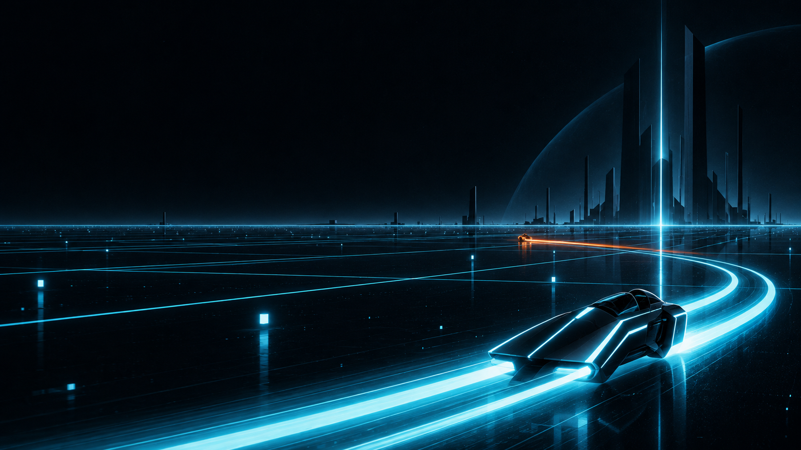
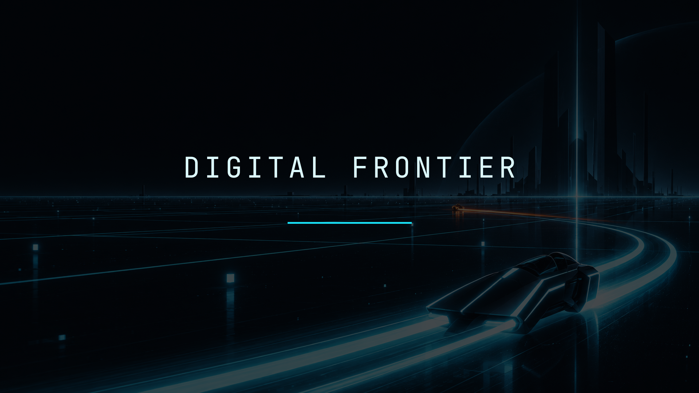

# Digital Frontier for Omarchy

An original Omarchy theme inspired by the stark black-glass computer worlds, optical glow, and precise geometric futurism of early-1980s science fiction.

Part of **[Movie Night](https://squatchware.dev/movies/)** from Squatchware: six Omarchy themes for the
films we rewound until the tape wore thin.




## Install

```sh
omarchy theme install https://github.com/squatchware/omarchy-digital-frontier-theme
```


## What's in it

- **Colours** for everything Omarchy themes (terminals, Hyprland, the shell, btop, editors…),
  generated by Omarchy from `colors.toml`. Every text colour clears 4.5:1 on its background.
  Palette: `#03060A` `#DDFBFF` `#19DDF2` `#FF4B55` `#62DB9A` `#F6D365` `#287BFF` `#A66BFF` `#19DDF2` `#FF8A2A`
- **Wallpapers:**
  - `01-digital-frontier.jpg`
  - `02-data-horizon.jpg`

## The rest of Movie Night

- [Clockstrike 88](https://github.com/squatchware/omarchy-clockstrike-88-theme): Midnight asphalt, plasma orange and clock-face gold: 1980s time travel.
- [Crossed Streams](https://github.com/squatchware/omarchy-crossed-streams-theme): Ectoplasm green and proton orange: a 1980s supernatural comedy.
- [Nostromo](https://github.com/squatchware/omarchy-nostromo-theme): Graphite hull, phosphor consoles and bone panels: industrial deep space.
- [Power Maze](https://github.com/squatchware/omarchy-power-maze-theme): Maze blue, power gold and chase red: a maze-chase arcade cabinet.
- [Tears in Rain](https://github.com/squatchware/omarchy-tears-in-rain-theme): Rain black and neon: the wet streets of 1980s cult sci-fi noir.

## Credits

The wallpapers are original AI-generated artwork: no film frames, titles, logos or actors. This is a
fan tribute with no connection to any studio or film. The theme files are MIT (see [LICENSE](LICENSE));
the wallpaper artwork is not covered by that licence.

From [Squatchware](https://squatchware.dev) · Pixel-powered apps, tools & themes. Handmade in the woods.
